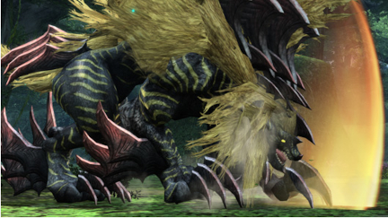
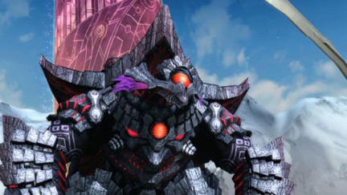
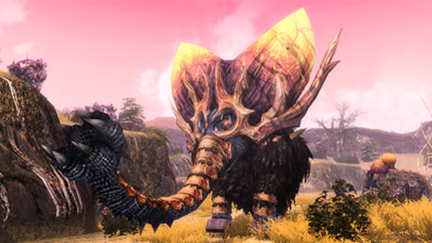
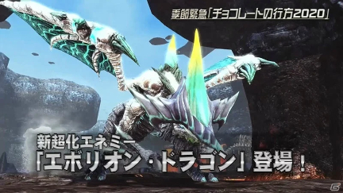

# MISSION：激震
> 最終更新: 2022/05/16  
> 🄫SEGA 『PHANTASY STAR ONLINE 2』公式サイト https://pso2.jp/  

## 🤔 激震とは？
PSO2時代の**チャレンジクエスト**という要素の１つです。  
装備は予め用意されたものを使用する為、PSO2側のデータがあれば誰でも参加できます。  
  
**『ソロで行く場合』と『みんなで行く場合』の難易度は ”圧倒的に" 異なります！！**  
**足を引っ張るかも・・・とかアレコレ考えず、とりあえず参加してみましょう！！**  
`このガイドに沿った攻略は、パープルトリガーやトリニテスより簡単です。`  
  ﾠﾠﾠ  
## ⭕️ やること
- **パルチザンを振り回して戦う**
- **[担当の場所](#-担当の場所)で解式PAを指定回数使う** [^1]
- **自分勝手に進まない**

**誇張一切無しで、文字通りのことしかやらないです。**  
パルチザンは初心者にも扱いやすい簡単な武器です。  
難しいことは考えず、『**常に後ろを付いてくる**』だけできれば何も問題ないです。  

**パルチザンの[参考動画](https://youtu.be/tD5ojNNlZE4?t=123)**  
`慣れてきたら、ソードも試してみてください。`    
`総合火力が上がって、M4が突破しやすくなります。`  
  ﾠﾠﾠ  
## ❌ やってはいけないこと
- **指示のない自己判断での解式PA**[^2]
- **先行, レンジャー, バウンサーより先に進むこと**[^3]

**簡単に攻略するためには、皆さんの ”徹底した協力” が必要**です。  
`※勝手に進んでエネミーを出現させてしまうと、安定した計画が崩れます。`  
  ﾠﾠﾠ  
## 📌 担当の場所
以下の５箇所のうち、**１人１箇所**の形で担当します。  
[M2 前半ボス担当](#m2-前半ボス担当) | [M2 後半ボス担当](#m2-後半ボス担当) | [M3 人型担当](#m3-人型担当) | [M4 前半ボス担当](#m2-前半ボス担当) | [M4 後半ボス担当](#m2-前半ボス担当)  
**初心者は基本的にM2のどちらかが担当として充てられます。**  
`※エネミーのHPを削る事が目的の為、失敗を恐れなくて大丈夫です。`  
___
### M2 前半ボス担当
**対象：ノーヴ・リンガダールの弱点部位**   
指示のあった武器で、解式PAを**撃てるだけ**撃ちます。   
`※浸食核かダウン時に露出するコアを狙う。`  
  
___
### M2 後半ボス担当
**対象：ファルス・アームの弱点部位**  
指示のあった武器で、解式PAを**撃てるだけ**撃ちます。  
`※手首側の赤い部分が弱点部位です。`  
  
___
### M3 人型担当
**対象：セイバーディグル×3**  
ランチャーで、解式PAをセイバーディグル群に**1回**撃ちます。  
`※Raがグラビティボムで１箇所に集めたところを狙う形です。`  
   
___
### M4 前半ボス担当
**対象１：ファングバンサーの弱点部位**  
ランチャーで、解式PAを**2回**撃ちます。  
`※顔か侵食核が弱点部位です。`  
  

**対象２：ゼッシュレイダの弱点部位**  
ランチャーで、解式PAを**2回**撃ちます。  
`※転倒時の胸のコアか侵食核が弱点部位です。`  
   
___
### M4 後半ボス担当
**対象１：プロジオーグルス**  
ランチャーで、解式PAを**2回**撃ちます。  
`※うなじのコブを部位破壊できると、ダウンを取れてなおよし。`  
   

**対象2：エボリオン・ドラゴンの顔**  
ランチャーで、解式PAを**2回**撃ちます。  
`※危険なので距離を置いた場所からがおすすめ。`  
   
  ﾠﾠﾠ  
## 🏆 実績

  
 <b>22/05/05 激震同好会立ち上げ</b>

  
  理論値が思ってた以上に簡単だったので、チムメンだけでやりたいなと思った次第。  
  とにかく練習とクエストの研究あるのみ。  
  ちなみに、激震同好会という名前は後に命名されたもの。  
  

 <b>22/05/15 初、理論値到達 🎉</b>

  
  合計7人、全員チムメンでの挑戦(激震経験者6人, 激震初心者1人)  
  武器ガチャではバレットボウが出ていました。  
  
    
    
  
  人数いればチムメンだけでも簡単に攻略できることが証明できました。  
  毎週開催できるように経験者・参加者をある程度確保したいところです。(一番の課題)  
  

(。・_・。)ノ いっぱいSG稼ごうね。
___
## 🎁 おまけ
**経験者向けの[詳細情報はこちら](Advance.md)**

[^1]: 解式PAはNGSのフォトンブラストのようなものです。  
[^2]: 使う場面・回数が確定的に決まっている為、計画が崩れてしまいます。  
[^3]: いろいろと不都合が出て、計画が崩れてしまいます。  
