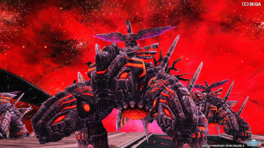
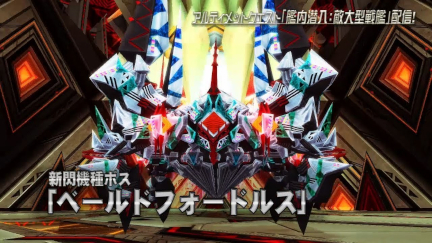

## 激震とは？
PSO2時代のチャレンジクエストという要素の１つです。  
面倒くさい部分を解式PAで突破できる為、始動や決断より圧倒的に簡単です。  
合計８の人員が確定的に必要です。  

## ⭕️ やること
- パルチザンを握ってPAを使う
- 担当の場所で解式PAを使う [^解式PA]
- チャットでの指示に従う

誇張無しで、文字通りのことしかやらないです。  

パルチザンの使い方は以下の動画を参照してください。  
<https://youtu.be/tD5ojNNlZE4?t=123> (2:03~3:47)  
動画と違い、ソードは使用しません。

## ❌ やってはいけないこと
- 担当の場所以外での解式PA[^解式PA禁止]
- 先行, レンジャー, バウンサーより先に進むこと[^先行禁止]

**簡単に攻略するためには、皆さんの ”徹底した協力” が必要**です。  

## 📌 担当の場所
以下の５箇所のうち、１箇所を１人が担当します。  
[M2担当 前半ボス](#m2担当-前半ボス) | [M2担当 後半ボス](#m2担当-後半ボス) | [M3担当 雑魚&中ボス](#m3担当-雑魚中ボス) | [M3担当 中ボス](#m3担当-中ボス) | [M4担当 ボス](#m4担当-ボス)  
参考として付けてある動画と解式PAを撃つ回数が異なりますが、より安定を考えた検討中のアレンジです。
___
### M2担当 前半ボス
**対象：ダウン中のノーヴ・リンガダールの弱点部位** [参考動画](https://youtu.be/mp2ldKfqfYY?t=343)  
指示のあった武器で、解式PAを撃てる分だけ撃ちます。   
  
___
### M2担当 後半ボス
**対象：ファルス・アームの弱点部位** [参考動画](https://youtu.be/mp2ldKfqfYY?t=442)  
指示のあった武器で、解式PAを撃てる分だけ撃ちます。  
  
___
### M3担当 雑魚&中ボス
**対象１：セイバーディグル×3** [参考動画](https://youtu.be/mp2ldKfqfYY?t=542)  
**対象２：ベールドフォードルス**  
ランチャーで、解式PAをセイバーディグルに１回。  
次に出現する、ベールドフォードルスに２回撃ちます。  
  
  
___
### M3担当 中ボス
**対象：ベールドフォードルス** [参考動画](https://youtu.be/mp2ldKfqfYY?t=542)  
ランチャーで、解式PAを２回撃ちます。   
  
___
### M4担当 ボス
**対象１：ファングバンサー** [参考動画](https://youtu.be/mp2ldKfqfYY?t=631)  
**対象２：ゼッシュレイダ**  
**対象３：プロジオーグルス**  
**対象４：エボリオン・ドラゴン**  
ランチャーで、解式PAをそれぞれに１回ずつ撃ちます。  

全てにおいてエネミーのHPを削る事が目的の為、失敗を恐れなくて大丈夫です。  
タイミング的な難易度は M3雑 ≒ M3中 ＞ M2前 ＞ M2後 ＞ M4 です。

## ⚔ ハンターを使う理由
### 攻略の前提が成り立たなくなるから
- M5のボスをオメガ・アンゲルに固定する為の必須条件です。
### 不都合が多い
- Hu, Ra, Bo 以外は解式PAを撃つことができません。  
- RaとBoは回復手段が乏しいことや、役割が被るため使用するべきでない。 

※練習時であればこの限りではないです。

## ⚙ 詳細

～ここから先は経験者向けの解説になります～ (クリックで展開)

  
> いろいろ書いてますが、検討段階の部分がところどころあります。  
> 何回か挑戦して、先行, Ra, Boだけで攻略における重要部分を確定させたい。  
> 運要素が絡むM2は特に何とかしたいです。  
## 解式PA
ソードとナックルは重すぎるから、使わないほうがいい(リセット)  
|武器名|消費ゲージ|系統|
|-|-|-|
|ランチャー|1|座標|
|バレットボウ|1|範囲|
|ジェットブーツ|2|範囲|
|ツインマシンガン|2|座標|

### バレットボウ
移動入力なし -> 単体攻撃  
移動入力あり -> 範囲攻撃  
どちらも発動からダメージ発生まで時間があるので、気持ち早めに撃つと良し。  
TP先のエルスクードは攻撃が間に合うか、倒せるかわかりません。  
[参考動画](https://youtu.be/wmfYHQxjCf0?t=110)

### ツインマシンガン
座標攻撃だが、モーションが長く火力低めらしい。  
TP先のエルスクードを倒せるか怪しい、リセットも一考。  
[参考動画](https://youtu.be/ptY-ZVyQIW8?t=96)

### ジェットブーツ
派生なし -> 範囲攻撃    
派生あり -> 単体攻撃  
ランチャーか弓が落ちなかった場合の保険。  
TP先のエルスクードも倒せる。(検証済み)  
[参考動画](https://youtu.be/wYwxEQQTcaM)  

## 先行の役割 
### M2 TP後
- 移動 -> Raの次
- 解式PA -> エルスクード [参考動画](https://youtu.be/mp2ldKfqfYY?t=368)
- 先行+ウォークライ -> ディゾルセイバー+オルカーバ
> ダメージ発生までのディレイを考えて、出現モーションが見えたら撃ち始めてOK
> 解式PAを撃ってる人がオルカーバの爆撃でやられる危険性がある
> ベイゼ前は Hu(先行), Ra(解式)でいくとよい

### M3
- 解式PA -> ラピドギルナス+α [参考動画](https://youtu.be/mp2ldKfqfYY?t=530)
- 解式PA -> ブレードディンゲール
- 先行+ウォークライ -> ディゾルセイバー [参考動画](https://youtu.be/mp2ldKfqfYY?t=542)
> ウォークライ -> チャージPA -> ステップ で生き残れるか？

### M4
- 解式PA -> ジャーマグルス [参考動画](https://youtu.be/mp2ldKfqfYY?t=678)
- 解式PA -> エンポリオン・ドラゴン+エンペラッピー
> エンポリオン・ドラゴンは顔に接近して、肩越しで尻尾を狙うイメージ
> 最悪壊せなくても、Raが解式撃って壊します。

## レンジャーの役割
### M2 TP前
- 解式PA -> ユグルドラーダ
> 要検討、ここで使わないならディゾルセイバーに回せる

### M2 TP後
- 移動 -> 先行より "先"、ヘイト回収 [参考動画](https://youtu.be/mp2ldKfqfYY?t=368)
- ウィークバレット -> エルスクード
- 寄り道 -> VR, マイル回収
- 1収束サテカノ -> ラディルーゴ
- 解式PA -> ディゾルセイバー [参考動画](https://youtu.be/mp2ldKfqfYY?t=420)
- 寄り道 -> ラッピー討伐
> ちゃんとヘイト引けるかは検証必須
> 2収束サテカノだとノックバックしてしまうので注意

### M3
- グラビティボム -> ディゾルセイバー
- ウィークバレット -> ベールドフォードルス
> ここのグラビティボムとウィークバレットは肩越しで撃ったほうが良さげ

### M4
- 解式PA -> 撃破に時間がかかりそうな場合

## バウンサーの役割
### M2 TP前
- 解式PA -> ヒュードアズール

### M2 TP後
- 移動 -> 左右砲台の破壊
- 銃座 -> ベイゼ破壊+残りのエネミー

### M3
- 寄り道 -> ラッピー討伐
- 解式PA -> ベールドフォードルス
> M3担当の人たちと一緒に撃ってほしい  
> モーション長いので雑魚出現で使って、中ボス出現時に派生？

### M4
- 寄り道 -> ラッピー討伐
- 解式PA -> ゲージが４以上であれば撃って良い

## M2のエルスクード
理論値に届かなくなるので、必ず倒したい。  
解式PA中は無敵ではないため、撃つ人はヘイト役の後に突入する。  
### ランチャーかバレットボウが落ちた場合
通常通りの方法で。  
バレットボウなら移動入力なしで撃つ。  
  
## M3のベールドフォードルス
目安はランチャーの解式4回らしい。  
M3担当2人とBoの解式でゴリ押ししたい。  
ランチャー3発+ジェットブーツ派生1発+(足りなければRaが追加で解式)
  
### 落ちなかった場合
ジェットブーツの解式PAで代用。  
最終弾の前に武器アクションで派生すると倒せる。  
M2開始時点でリセットもぜんぜんアリ。  

## 激震のギミック
### ラッピー
早めに倒さないと消えてしまう。(らしい？)  
地味に硬い。

### アンロックスイッチ
ラッシュ構成の理論値激震であるなら、押す必要ない。  
ただ、押しても特に不都合はない。  

### テレポーター
誰か１人が入ると時間制限のトライアルが発生する。  
準備ができるまで入らせてはいけない。  

### M3のカタパルト
飛ぶだけならOK、１歩でも前に出たらエネミーが出現する。  
早めに待機指示を出すべき。  

 
[^解式PA]: 解式PAはNGSのフォトンブラストのようなものです。  
[^解式PA禁止]: 使う場面・回数が確定的に決まっている為、計画が崩れてしまいます。  
[^先行禁止]: いろいろと不都合が出て、計画が崩れてしまいます。  
