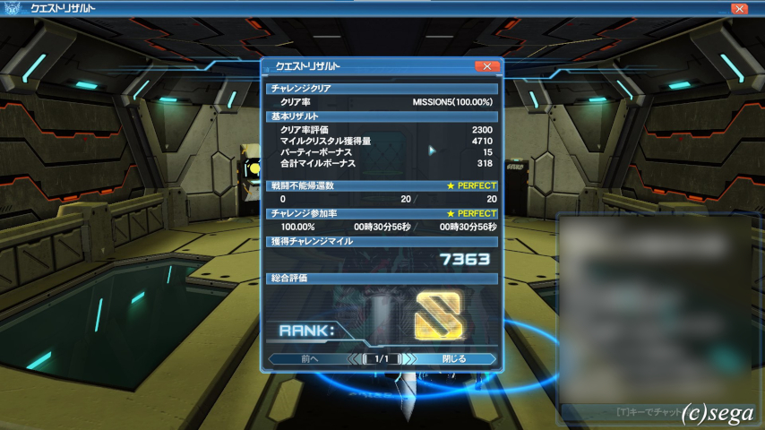
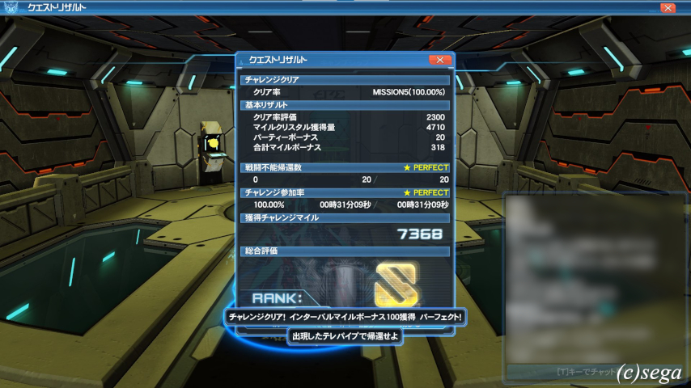

# MISSION：激震
情報の最終更新: 2022/5/16
## 激震とは？
PSO2時代のチャレンジクエストという要素の１つです。  
面倒くさい部分を解式PAで突破できる為、始動や決断より圧倒的に簡単です。  
合計８の人員が確定的に必要です。  

## ⭕️ やること
- **パルチザンを握ってPAを使う**
- **[担当の場所](#-担当の場所)で解式PAを指定回数使う** [^解式PA]
- **チャットでの指示に従う**

誇張無しで、文字通りのことしかやらないです。  

パルチザンの使い方は以下の動画を参照してください。  
<https://youtu.be/tD5ojNNlZE4?t=123> (2:03~3:47)  
動画と違い、ソードは使用しません。  
`火力的にはソードの方がでるらしいけど、あなたが使いやすいほうで。`  

## ❌ やってはいけないこと
- **『担当の場所以外』での解式PA**[^解式PA禁止]
- **先行, レンジャー, バウンサーより先に進むこと**[^先行禁止]

**簡単に攻略するためには、皆さんの ”徹底した協力” が必要**です。  
`※勝手に進んでエネミーを出現させてしまうと、安定した計画が崩れます。`  

## 📌 担当の場所
以下の５箇所のうち、１箇所を１人が担当します。  
[M2 前半ボス担当](#m2-前半ボス担当) | [M2 後半ボス担当](#m2-後半ボス担当) | [M3 人型担当](#m3-人型担当) | [M4 前半ボス担当](#m2-前半ボス担当) | [M4 後半ボス担当](#m2-前半ボス担当)  
**参考動画と解式PAを撃つ回数・場所が異なります。**  
`※全てにおいてエネミーのHPを楽に削る事が目的の為、失敗を恐れなくて大丈夫です。`  
___
### M2 前半ボス担当
**対象：ノーヴ・リンガダールの弱点部位** [参考動画](https://youtu.be/mp2ldKfqfYY?t=343)  
指示のあった武器で、解式PAを**撃てるだけ**撃ちます。   
`※浸食核かダウン時に露出するコアを狙う。`  
  
___
### M2 後半ボス担当
**対象：ファルス・アームの弱点部位** [参考動画](https://youtu.be/mp2ldKfqfYY?t=442)  
指示のあった武器で、解式PAを**撃てるだけ**撃ちます。  
`※手首側の赤い部分が弱点部位です。`  
  
___
### M3 人型担当
**対象：セイバーディグル×3** [参考動画](https://youtu.be/mp2ldKfqfYY?t=542)  
ランチャーで、解式PAをセイバーディグル群に**1回**撃ちます。  
`※Raがグラビティボムで１箇所に集めたところを狙う形です。`  
   
___
### M4 前半ボス担当
**対象１：ファングバンサーの弱点部位** [参考動画](https://youtu.be/mp2ldKfqfYY?t=631)  
ランチャーで、解式PAを**2回**撃ちます。  
`※顔か侵食核が弱点部位です。`  

**対象２：ゼッシュレイダの弱点部位**  
ランチャーで、解式PAを**2回**撃ちます。  
`※転倒時の胸のコアか侵食核が弱点部位です。`  

___
### M4 後半ボス担当
**対象１：プロジオーグルス**  
ランチャーで、解式PAを**2回**撃ちます。  
`※うなじのコブを部位破壊できると、ダウンを取れてなおよし。`  

**対象2：エボリオン・ドラゴン**  
ランチャーで、解式PAを**2回**撃ちます。  
`※顔狙いで大丈夫です。危険なので遠くからがおすすめ。`  

   

## ⚔ ハンターを使う理由
### 攻略の前提が成り立たなくなるから
- M5のボスをオメガ・アンゲルに固定する為の必須条件です。
### 不都合が多い
- Hu, Ra, Bo 以外は解式PAを撃つことができません。  
- RaとBoは回復手段が乏しいことや、役割が被るため使用するべきでない。   
`※練習時であればこの限りではないです。`

## 🏆 実績

 <b>22/05/05 激震同好会立ち上げ</b> (クリックで展開)

  
  理論値到達が思ってた以上に簡単だったので、チムメンだけでやりたいなと思った次第。  
  激震同好会という名前は後に命名されたもの。  
  とにかく練習とクエストの研究あるのみ  
  

 <b>22/05/15 初、理論値到達 🎉</b> (クリックで展開)

  
  合計7人、全員チムメンでの挑戦(激震経験者6人, 激震初心者1人)  
  武器ガチャではバレットボウが出ていました。  
  
    
    
  
  人数いれば簡単に攻略できることが証明できました。  
  毎週開催できるように経験者・参加者をある程度確保したいところです。(一番の課題)  
  

## ⚙ 詳細

～ここから先は経験者向けの解説になります～ (クリックで展開)

  
> いろいろ書いてますが、検討段階の部分がところどころあります。  
> 何回か挑戦して、先行, Ra, Boだけで攻略における重要部分を確定させたい。  
> 運要素が絡むM2は特に何とかしたいです。  
  
## ドロップに左右されない解式PA

### ◾ 先行 合計消費ストック: 8
**M2** 消費ストック: 2\~4  
・TP後 → エルスクード  
・毒縄跳び後 → ディゾルセイバー  
> 確殺を考えるとランチャーかジェットブーツ推奨  
> ジェットブーツの方法を確立させると、Hu(一般)の武器渡しが楽になっていいかも  
> ただ、ファルスアーム前までBoが暇になっちゃう(※要相談)  
> 銃座やってもらうか？→やってもらってる間に置く  
___
**M3** 消費ストック: 1\~2  
・カタパルト前 → ラピドギルナス+α  
> M3以降はバレットボウを使用する。  
> なお、ストック2あるなら、その後の出現エネミーにも撃ってもよい  
___
**M4** 消費ストック: 2  
・ギグル・グンネガム撃破後 → ジャーマグルス  
・ジャーマグルス撃破後 → エンポリオン・ドラゴン + エンペラッピー  
> ちょっと攻撃したらカタパルト解放ガン待ちしたほうがいいかもです。  
___
**M5** 消費ストック: all  
・開始後 → オメガ・アンゲル
> ストックが余ってれば
___
...
### ◾ レンジャー 合計消費ストック: 6
**M2** 消費ストック: 2  
・TP前 → ユグルドラーダ  
> Boからジェットブーツ借ります
___
**M3** 消費ストック: 0\~1  
・カタパルト前 → ブレードディンゲール
> 先行が撃つならそっちにまかせていい  
___
**M4** 消費ストック: 2  
・自由 → 時間かかりそうなエネミーに対して
> 直感に任せる  
___
**M5** 消費ストック: all 
・開始後 → オメガ・アンゲル
> WB撃ったあとに1発入れる想定
___
...
### ◾ バウンサー 合計消費ストック: 6
**M2** 消費ストック: 2  
・TP前 → ヒュードアズール  
> おそらく倒せてしまう方が珍しい？  
___
**M3** 消費ストック: 2  
・カタパルト先 → セイバーディグル  
> M3担当だけだと確殺が怪しいので追加で撃って欲しい  
> ベールドフォードルスの出現モーションのタイミングで派生させると、そっちにもワンチャンダメージ入りそう  
___
**M5** 消費ストック: 2  
・開始後 → オメガ・アンゲル  
> 吸い込み攻撃があるので、派生させない方がいい  
___

  
## M2の解式PA順序
武器交換の回数を極力減らしたい  
先行の解式PAはM3突入時点で2欲しい  
溜まりやすいという文句を信じるしかない  
### TP前
- Ra -> ユグルドラーダ  
殲滅が終わったら、M2担当前半に武器を渡す  
  
- Bo -> ヒュードアズール  
- Hu(一般) -> ノーヴ・リンガダール  
討伐が終わったらTP前に、Hu(先行)に武器をわたす  
  
## TP後
- Hu(先行) -> エルスクード  
- Hu(先行) -> ディゾルセイバー  
ファルスアーム前に、Hu(一般)に武器をわたす  
- Hu(一般) -> ファルス・アーム
  
## 解式PAのストック数
ジャガさんの動画を基準に考える  

[参考：解式PAゲージの蓄積条件](http://blog.livedoor.jp/swanday/archives/80912078.html)  
とにかく殴ってダメージいっぱい出せば出すほど溜まる  
### M2 TP突入前
Hu -> ストック4は絶対に溜まる  
Ra&Bo -> ストック3  

<例外 Bo靴>
Ra -> ユグルドラーダ  
Bo -> ヒュードアズール  
Hu -> エルスクード+ディゾルセイバー  

### IA1 突入時点
Hu -> ストック4\~6  
Ra&Bo -> ストック3\~4  

### M3 最初のポイントの殲滅後
Hu -> ストック5以上 (ほぼ確定)  
Ra&Bo -> ストック4 (ほぼ確定)  
  
<例外>
Hu -> ラピドギルナス+α  
Ra -> ブレードディンゲール  
Bo -> ベールドフォードルス  
  
この時点で全員解式0だと思われる。
  
### M4 ゼッシュレイダの辺り
Hu -> ストック6  
Ra&Bo -> ストック5  
  
### M4 プロジオーグルスの辺り
Hu -> ストック7(上限は6)  
Ra&Bo -> ストック5  
  
### M4 エボリオン・ドラゴンの辺り
Hu -> ストック8(上限は6)  
Ra&Bo -> ストック6  
  
##激震全体を通して
Huは8, Raは6のストックを溜められると考えるといいか？  
  
## 解式PAの消費ストック
M1で以下4つのいずれも出なかった場合はリセットしていいかも  
参加メンバーが激震に慣れてきたらそのまま続けても可  
|武器名|消費ゲージ|系統|
|-|-|-|
|ランチャー|1|座標|
|バレットボウ|1|範囲|
|ジェットブーツ|2|範囲|
|ツインマシンガン|2|座標|

ソードとナックルは重すぎるから、使わないほうがいい  
いや使わないでくれ  

Huの解式の難易度(主観は M3雑 ≒ M3中 ＞ M2前 ＞ M2後 ＞ M4  
M3は死人が出る可能性あるので、Boが追加で解式撃ってほしい  
  
### バレットボウ
移動入力なし -> 単体攻撃  
移動入力あり -> 範囲攻撃  
どちらも発動からダメージ発生まで時間があるので、気持ち早めに撃つと良し。  
TP先のエルスクードは攻撃が間に合うか、倒せるかわかりません。  
[参考動画](https://youtu.be/wmfYHQxjCf0?t=110)

### ツインマシンガン
座標攻撃だが、モーションが長く火力低めらしい。  
TP先のエルスクードを倒せるか怪しい、リセットも一考。  
[参考動画](https://youtu.be/ptY-ZVyQIW8?t=96)

### ジェットブーツ
派生なし -> 範囲攻撃    
派生あり -> 単体攻撃  
ランチャーか弓が落ちなかった場合の保険。  
TP先のエルスクードも倒せる。(検証済み)  
[参考動画](https://youtu.be/wYwxEQQTcaM)  

## 先行の役割  
ウォークライ使うのでハンターがいい  
### M2 TP後
- 移動 -> Raの次
- 解式PA -> エルスクード [参考動画](https://youtu.be/mp2ldKfqfYY?t=368)
- 先行+ウォークライ -> ディゾルセイバー+オルカーバ  
> ダメージ発生までのディレイを考えて、出現モーションが見えたら撃ち始めてOK  
> 解式PAを撃ってる人がオルカーバの爆撃でやられる危険性がある  
> ベイゼ前は Hu(先行), Ra(解式)でいくとよい  

### M3
- 解式PA -> ラピドギルナス+α [参考動画](https://youtu.be/mp2ldKfqfYY?t=530)
- 解式PA -> ブレードディンゲール
- 先行+ウォークライ -> ディゾルセイバー [参考動画](https://youtu.be/mp2ldKfqfYY?t=542)
> ウォークライ -> チャージPA -> ステップ で生き残れるか？  

### M4
- 解式PA -> ジャーマグルス [参考動画](https://youtu.be/mp2ldKfqfYY?t=678)
- 解式PA -> エンポリオン・ドラゴン+エンペラッピー
> エンポリオン・ドラゴンは顔に接近して、肩越しで尻尾を狙うイメージ  
> 最悪壊せなくても、Raが解式撃って壊します。

## レンジャーの役割
WB撃つ、M3以降は解式PA足りなそうなところのバックアップ  
  
### 解式PAタイミング一覧(仮)
M2 TP前 -> ユグルドラーダ  
M3 カタパルト前 -> ベールドフォードルス  
M5 -> オメガ・アンゲル  
全部ジェットブーツで撃つ
  
  
### M2 TP前
- 解式PA -> ユグルドラーダ
> 要検討、ここで使わないならディゾルセイバーに回せる

### M2 TP後
- 移動 -> 先行より "先"、ヘイト回収 [参考動画](https://youtu.be/mp2ldKfqfYY?t=368)
- ウィークバレット -> エルスクード
- 寄り道 -> VR, マイル回収
- 1収束サテカノ -> ラディルーゴ
- 解式PA -> ディゾルセイバー [参考動画](https://youtu.be/mp2ldKfqfYY?t=420)
- 寄り道 -> ラッピー討伐
> ちゃんとヘイト引けるかは検証必須  
> 2収束サテカノだとノックバックしてしまうので注意

### M3
- グラビティボム -> ディゾルセイバー
- ウィークバレット -> ベールドフォードルス
> ここのグラビティボムとウィークバレットは肩越しで撃ったほうが良さげ

### M4
- 解式PA -> 撃破に時間がかかりそうな場合

## バウンサーの役割
いつもありがとうございます  
集敵、範囲解式PA様様  
  
### 解式PAタイミング一覧(仮)
M2 TP前 -> ヒュードアズール  
M3 カタパルト先 -> ブレードディンゲール  
M5 -> オメガ・アンゲル  
全部ジェットブーツで撃つ
  
### M2 TP前
- 解式PA -> ヒュードアズール

### M2 TP後
- 移動 -> 左右砲台の破壊
- 銃座 -> ベイゼ破壊+残りのエネミー

### M3
- 寄り道 -> ラッピー討伐
- 解式PA -> ベールドフォードルス
> M3担当の人たちと一緒に撃ってほしい  
> モーション長いので雑魚出現で使って、中ボス出現時に派生？

### M4
- 寄り道 -> ラッピー討伐
- 解式PA -> ゲージが４以上であれば撃って良い

## M2のエルスクード
理論値に届かなくなるので、必ず倒したい。  
解式PA中は無敵ではないため、撃つ人はヘイト役の後に突入する。  
WBの装填数を1にしてエルスクードに撃ったのち、通常攻撃で他のヘイトを取る  
Ra(先行), Hu(解式)の順かなぁ  
### ランチャーかバレットボウが落ちた場合
通常通りの方法で。  
バレットボウなら移動入力なしで撃つ。  
  
## M3のベールドフォードルス
目安はランチャーの解式4回らしい。  
M3担当2人とBoの解式でゴリ押ししたい。  
ランチャー3発+ジェットブーツ派生1発+(足りなければRaが追加で解式)
  
### 落ちなかった場合
ジェットブーツの解式PAで代用。  
最終弾の前に武器アクションで派生すると倒せる。  
M2開始時点でリセットもぜんぜんアリ。  

## 激震のギミック
### ラッピー
早めに倒さないと消えてしまう。(らしい？)  
地味に硬い。

### アンロックスイッチ
ラッシュ構成の理論値激震であるなら、押す必要ない。  
ただ、押しても特に不都合はない。  

### テレポーター
誰か１人が入ると時間制限のトライアルが発生する。  
準備ができるまで入らせてはいけない。  

### M3のカタパルト
飛ぶだけならOK、１歩でも前に出たらエネミーが出現する。  
早めに待機指示を出すべき。  

[^解式PA]: 解式PAはNGSのフォトンブラストのようなものです。  
[^解式PA禁止]: 使う場面・回数が確定的に決まっている為、計画が崩れてしまいます。  
[^先行禁止]: いろいろと不都合が出て、計画が崩れてしまいます。  
